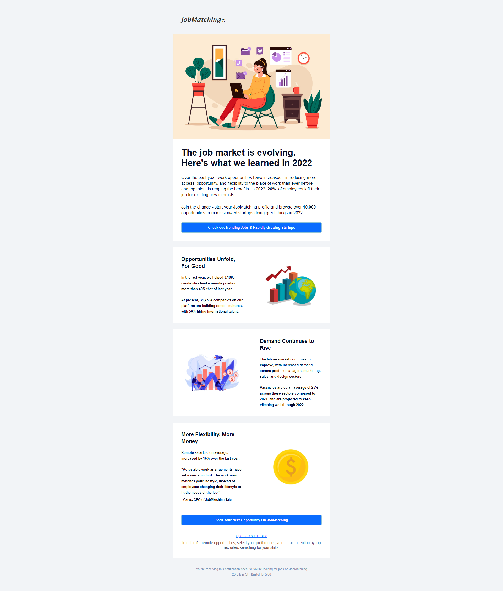

## Table of contents

- [Overview](#overview)
  - [The challenge](#the-challenge)
  - [Screenshot](#screenshot)
  - [Links](#links)
- [My process](#my-process)
  - [Built with](#built-with)
  - [What I learned](#what-i-learned)
  - [Continued development](#continued-development)
  - [Useful resources](#useful-resources)
- [Author](#author)

## Overview

A responsive promotional email without media queries

### The challenge

Creating a fully responsive email without media queries. Most email apps support modern CSS and media queries
but there are still many that don't. With this in mind the challenge is to build a responsive email that works for both email clients that
support and for those that do NOT support modern CSS, like media queries. I am using the fluid hybrid method of HTML email development to achieve this.

### Screenshot

### Links

- Live Site URL: https://

## My process

- Based on a newsletter email I found in my own email inbox
- I created a fictitious company and I heavily customised the email content
- I added images from https://www.freepik.com. They are optimised and hosted online
- I coded the email follwing CSS2 specificaton, using tables, inline CSS and div/media queries for email clients that support them
- Made it look as good as possible for dark mode
- I used Desktop-first approach as that's the best practice for email development
- I tested my email using Litmus.
- I uploaded the email the web via

### Built with

- HTML5 markup with CSS2
- An HTML Tag that defines the XML and OOMXML (Office Open XML) which The HTML document needs for the email to work on Outlook on Windows
- An Apple Scaling Meta Tag that prevents any unwanted scaling or zooming from Apple
- An IE9 Meta Tag used for improving rendering in Iternet Explorer 9 or lower
- An XML Tag that ensures that Microsoft Outlook transforms everything in our email to adapt to the screen zoom percentage in Windows
- Inline CSS which is best practice for email as some clients strip out the head tag of emails
- Some media queries within the style tag in the head tag for clients that do support them. This is for enhancement only
- For apps that support modern CSS I am using an outer container in the form of a div which has the use of max-width and display: inline-block
  properties
- For email clients that do not support modern CSS I use Ghost tables which are restrictive table layouts for Outlook email clients
- Divs, max-width and display:inline-block are used for layouts with 2 and more columns. For a single column layout I use tables
- For 2 columns and more I also have a nested div inside each column for padding. This is applied to the ghost table cells for Outlook
- Use of a spacer div to create space between sections
- Desktop-first workflow

### What I learned

I learnt how to code a responsive email and how to test an email for the various email clients

### Continued development

I will continue to improve and practice coding emails!

### Useful resources

I am thankful to Email Geeks, Remi Parmentier of https://www.hteumeuleu.com/, Nicole Merlin and https://www.goodemailcode.com/

## Author

- Website - https://www.annie-indreiten.com/
- Github – https://github.com/AnnieCat73
- LinkedIn - https://www.linkedin.com/in/annie-indreiten777/
